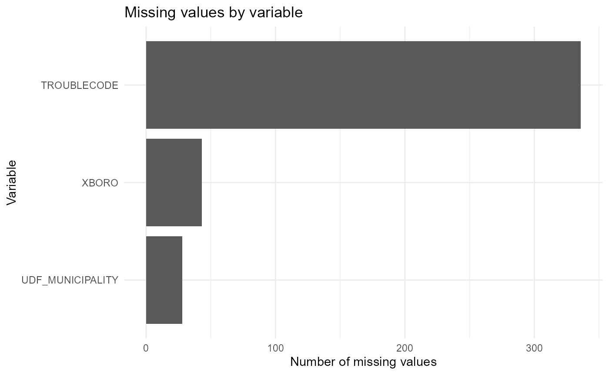
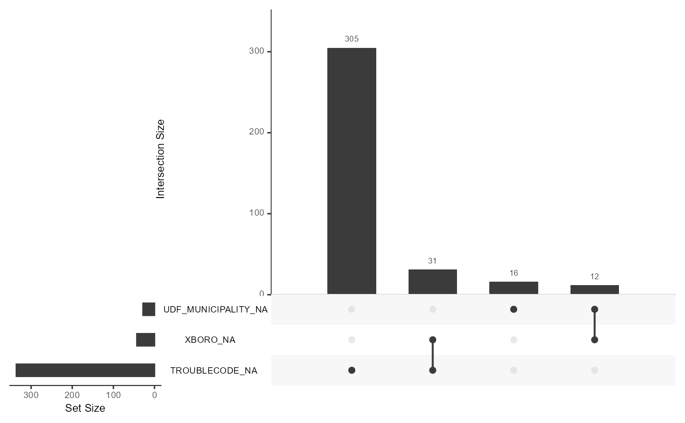

# Data

## Description

We are using a dataset sourced from Con Edison’s Outage Management
System (OMS). For context, Con Edison is a utility based in New York
City. It provides electricity, gas, and steam for NYC and Westchester
County. The OMS team analyzes and reports power outage and non-outage
events across all 5 boroughs and Westchester. The event-level columns
we’re using are: Event ID - a unique identifier per record Total
Customers Affected - the number of customers out of power on the
particular event Start Date - the date and time that the event began
Restoration Date - the date and time that the power was restored for the
particular event Completed Date - the date and time that the event was
completed. If the event is a non-outage, the restoration and the
completed date will be the same. Momentary Event Flag - displays 1 if
the event is a momentary event, 0 if the event is not. Momentaries are
events that are restored within 15 min of their start date. Device
Type - the type of device affected on the event. Devices are the
structures that provide power to customers. One device can supply power
to multiple residencies. Device Outage Flag - displays 1 if the device
is out, 0 if the device on the event is not. Outage Flag - displays 1 if
the event has customers out of power, 0 if there are no customers
affected. XBoro - the name of the Borough where the event is located Udf
Municipality - For NYC, this is the name of the borough where the event
is located. For Westchester, this is the name of the specific muni where
the event is located. Trouble Code - the short code describing clues for
the event. There is a legend mapping the trouble code short name to the
long name e.g. NL = No lights, SO = Side Off.

We are using a year’s worth of data from October 2024 to October 2025.

``` r
suppressPackageStartupMessages({
library(tidyverse)
library(fs)
})

data_path    <- fs::path("..","inst/extdata", "PackageData.csv")
outages_raw  <- readr::read_csv(data_path, show_col_types = FALSE)

source(fs::path("..","R", "MissingAnalysis.R"))

summary(outages_raw)
```

    ##    STARTDATE                      RESTDATE                  
    ##  Min.   :2024-10-25 00:05:00   Min.   :2024-10-25 00:14:02  
    ##  1st Qu.:2025-02-12 16:06:54   1st Qu.:2025-02-17 10:42:30  
    ##  Median :2025-05-08 15:32:11   Median :2025-05-12 18:03:53  
    ##  Mean   :2025-05-02 14:21:44   Mean   :2025-05-07 11:11:02  
    ##  3rd Qu.:2025-07-14 05:08:01   3rd Qu.:2025-07-19 20:56:11  
    ##  Max.   :2025-10-24 23:24:56   Max.   :2025-10-28 16:39:35  
    ##     COMPDATE                      EVENTID        TOTALCUSTAFFECTED
    ##  Min.   :2024-10-25 00:14:02   Min.   :3524920   Min.   :   0.00  
    ##  1st Qu.:2025-02-17 12:55:53   1st Qu.:3745292   1st Qu.:   0.00  
    ##  Median :2025-05-12 19:00:13   Median :3809224   Median :   0.00  
    ##  Mean   :2025-05-07 14:19:10   Mean   :3815083   Mean   :   5.05  
    ##  3rd Qu.:2025-07-20 00:26:12   3rd Qu.:3883297   3rd Qu.:   0.00  
    ##  Max.   :2025-10-28 16:39:36   Max.   :3954701   Max.   :5976.00  
    ##  MOMENTARYEVENTFLAG  DEVICETYPE        DEVICEOUTAGEFLAG    OUTAGEFLAG    
    ##  Min.   :0.0000     Length:145404      Min.   :0.00000   Min.   :0.0000  
    ##  1st Qu.:0.0000     Class :character   1st Qu.:0.00000   1st Qu.:0.0000  
    ##  Median :0.0000     Mode  :character   Median :0.00000   Median :0.0000  
    ##  Mean   :0.1185                        Mean   :0.06315   Mean   :0.1177  
    ##  3rd Qu.:0.0000                        3rd Qu.:0.00000   3rd Qu.:0.0000  
    ##  Max.   :1.0000                        Max.   :1.00000   Max.   :1.0000  
    ##     XBORO           UDF_MUNICIPALITY   TROUBLECODE       
    ##  Length:145404      Length:145404      Length:145404     
    ##  Class :character   Class :character   Class :character  
    ##  Mode  :character   Mode  :character   Mode  :character  
    ##                                                          
    ##                                                          
    ## 

## Data Cleaning Principles

We cleaned the Con Edison outage dataset by standardizing all date
fields, correcting common formatting errors, and enforcing chronological
consistency across STARTDATE, RESTDATE, and COMPDATE. Empty strings were
converted to missing values prior to parsing, and mixed timestamp
formats were resolved using flexible
[`parse_date_time()`](https://rdrr.io/pkg/lubridate/man/parse_date_time.html)
rules. Because some outages incorrectly reported 2023 timestamps,
restoration and completion dates labeled as 2023 were shifted forward by
one year. Records missing critical fields such as COMPDATE or
TOTALCUSTAFFECTED were removed. Categorical fields such as XBORO were
normalized to uppercase to support grouping and visualization. The
resulting dataset is tidy and chronologically valid.

## Missing value analysis

In our preprocessing workflow, we first removed rows missing COMPDATE or
TOTALCUSTAFFECTED. These two fields are essential: COMPDATE is required
to compute outage duration, while TOTALCUSTAFFECTED determines the
severity of an event. After filtering out these critical cases, our
missing value analysis focuses only on UDF_MUNICIPALITY, TROUBLECODE,
and unknown borough entries (“-NDA-”) in XBORO.

``` r
missing_tbl <- missing_nonzero(outages_raw, treat_ndas = TRUE)
missing_tbl
```

    ## # A tibble: 3 × 3
    ##   variable         na_count na_percent
    ##   <chr>               <int>      <dbl>
    ## 1 TROUBLECODE           336     0.231 
    ## 2 XBORO                  43     0.0296
    ## 3 UDF_MUNICIPALITY       28     0.0193

``` r
plot_missing_bar(outages_raw, treat_ndas = TRUE, only_nonzero = TRUE)
```



``` r
# Upset plot for missingness pattern
plot_missing_upset(outages_raw, treat_ndas = TRUE)
```

    ## Warning: `aes_string()` was deprecated in ggplot2 3.0.0.
    ## ℹ Please use tidy evaluation idioms with `aes()`.
    ## ℹ See also `vignette("ggplot2-in-packages")` for more information.
    ## ℹ The deprecated feature was likely used in the UpSetR package.
    ##   Please report the issue to the authors.
    ## This warning is displayed once every 8 hours.
    ## Call `lifecycle::last_lifecycle_warnings()` to see where this warning was
    ## generated.

    ## Warning: Using `size` aesthetic for lines was deprecated in ggplot2 3.4.0.
    ## ℹ Please use `linewidth` instead.
    ## ℹ The deprecated feature was likely used in the UpSetR package.
    ##   Please report the issue to the authors.
    ## This warning is displayed once every 8 hours.
    ## Call `lifecycle::last_lifecycle_warnings()` to see where this warning was
    ## generated.

    ## Warning: The `size` argument of `element_line()` is deprecated as of ggplot2 3.4.0.
    ## ℹ Please use the `linewidth` argument instead.
    ## ℹ The deprecated feature was likely used in the UpSetR package.
    ##   Please report the issue to the authors.
    ## This warning is displayed once every 8 hours.
    ## Call `lifecycle::last_lifecycle_warnings()` to see where this warning was
    ## generated.



Most missingness is isolated to `TROUBLECODE`, but very few observations
are missing multiple fields at once, indicating that missingness is
sparse.
